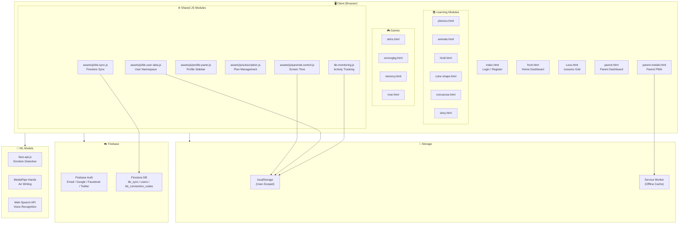
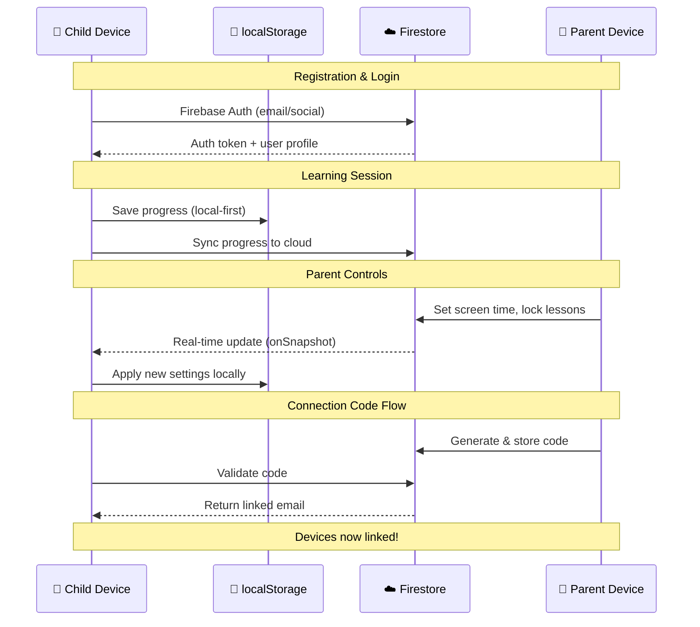
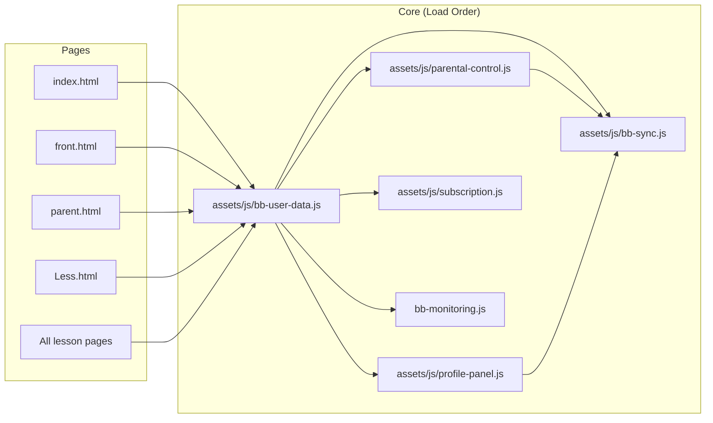
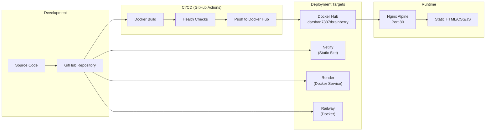
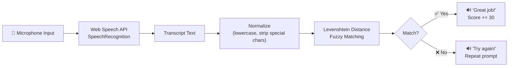

# 🍓 BrainBerry — System Architecture

> Visual architecture diagrams for the BrainBerry learning platform.

---

## High-Level Architecture

---

## Data Flow

---

## Module Dependency Graph

---

## Deployment Architecture

---

## Voice Recognition Pipeline

