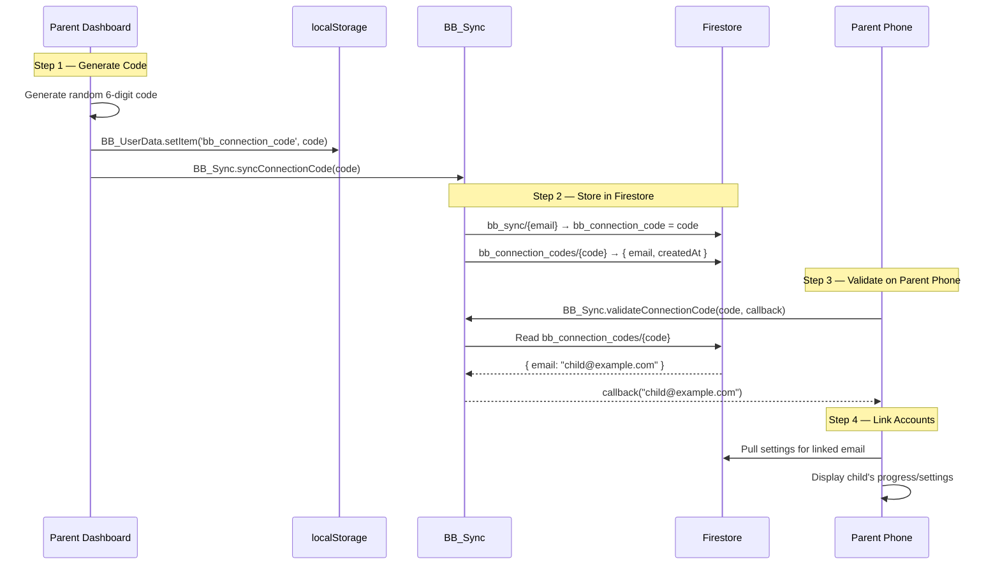
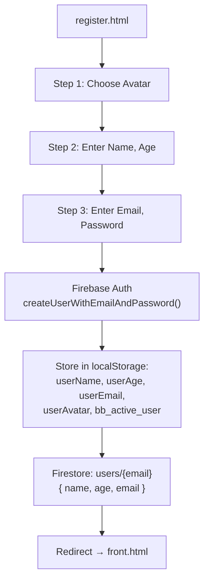
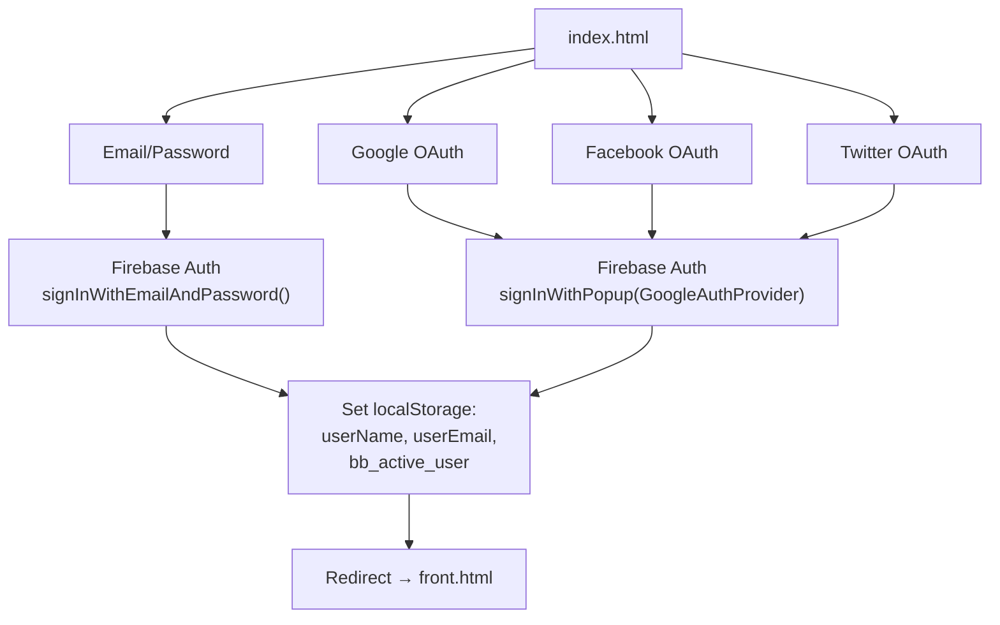

# BrainBerry — API Documentation

> Internal JavaScript API reference for BrainBerry's core modules.

---

## Table of Contents

- [BB_UserData API](#bb_userdata-api)
- [BB_Sync API](#bb_sync-api)
- [BB_Monitor API](#bb_monitor-api)
- [BB_Progress API](#bb_progress-api)
- [BB_ScreenTime API](#bb_screentime-api)
- [BB_Subscription API](#bb_subscription-api)
- [Connection Code Protocol](#connection-code-protocol)
- [Firebase Auth Flow](#firebase-auth-flow)
- [Profile Panel API](#profile-panel-api)

---

## BB_UserData API

**Source:** `assets/js/bb-user-data.js`
**Exposed on:** `window.BB_UserData`
**Dependency:** None (must be loaded first)

Provides per-user namespaced access to `localStorage`. All keys are prefixed with `bb_user:<email>:` to isolate data between different child accounts on the same device.

### Namespace Pattern

```
bb_user:<email>:<key>
```

The email is sourced from `localStorage.getItem('bb_active_user')` or `localStorage.getItem('userEmail')`, falling back to `"guest"` if no user is logged in.

### Methods

#### `BB_UserData.getItem(key)`

Reads a user-scoped value from localStorage.

| Parameter | Type | Description |
|-----------|------|-------------|
| `key` | `string` | Logical key name (e.g. `'bb_parent_pin'`) |

**Returns:** `string | null` — The stored value, or `null` if not found.

```javascript
var pin = BB_UserData.getItem('bb_parent_pin');
// Reads: localStorage['bb_user:alice@example.com:bb_parent_pin']
```

#### `BB_UserData.setItem(key, value)`

Writes a user-scoped value to localStorage.

| Parameter | Type | Description |
|-----------|------|-------------|
| `key` | `string` | Logical key name |
| `value` | `string` | Value to store |

```javascript
BB_UserData.setItem('bb_parent_pin', '1234');
// Writes: localStorage['bb_user:alice@example.com:bb_parent_pin'] = '1234'
```

#### `BB_UserData.removeItem(key)`

Removes a user-scoped value from localStorage.

| Parameter | Type | Description |
|-----------|------|-------------|
| `key` | `string` | Logical key name |

```javascript
BB_UserData.removeItem('bb_parent_pin');
```

#### `BB_UserData.isNewUser()`

Returns `true` if the current user has never had parental controls configured (no PIN and no assigned lessons stored).

**Returns:** `boolean`

```javascript
if (BB_UserData.isNewUser()) {
  // Show "Set up parent controls" prompt
}
```

#### `BB_UserData.key(key)`

Returns the full namespaced localStorage key string for direct access.

| Parameter | Type | Description |
|-----------|------|-------------|
| `key` | `string` | Logical key name |

**Returns:** `string` — Full namespaced key.

```javascript
var fullKey = BB_UserData.key('bb_progress');
// Returns: 'bb_user:alice@example.com:bb_progress'
```

#### `BB_UserData.currentPrefix()`

Returns the namespace prefix for the current user. Useful for debugging.

**Returns:** `string` — e.g. `'bb_user:alice@example.com:'`

---

## BB_Sync API

**Source:** `assets/js/bb-sync.js`
**Exposed on:** `window.BB_Sync`
**Dependency:** `assets/js/bb-user-data.js`

Provides Firebase Firestore-based real-time synchronisation for parent ↔ child data. Lazily initialises Firebase on first use.

### Synced Keys

The following localStorage keys are synced between the local device and Firestore:

| Key | Description |
|-----|-------------|
| `bb_parent_pin` | 4-digit parent PIN |
| `bb_assigned_lessons` | JSON array of locked/unlocked lesson IDs |
| `bb_screen_time_limit` | Screen time limit in seconds |
| `bb_screen_time_elapsed` | Elapsed screen time in seconds |
| `bb_progress` | JSON object `{ correct, wrong, lessonsCompleted }` |
| `bb_connection_code` | 6-digit connection code |
| `bb_todos` | JSON array of parent-assigned to-do items |

### Methods

#### `BB_Sync.pushSettings()`

Pushes all synced keys from user-scoped localStorage to the Firestore `bb_sync` collection.

**Returns:** `Promise<void>`

```javascript
await BB_Sync.pushSettings();
// Writes to: Firestore → bb_sync/<sanitized_email>
```

The Firestore document also includes:
- `_updatedAt` — ISO 8601 timestamp
- `_email` — Raw email address

#### `BB_Sync.pullSettings()`

Pulls the latest settings from Firestore into user-scoped localStorage.

**Returns:** `Promise<void>`

```javascript
await BB_Sync.pullSettings();
// Reads from: Firestore → bb_sync/<sanitized_email>
// Writes to: localStorage (via BB_UserData)
```

#### `BB_Sync.syncConnectionCode(code)`

Stores a connection code in three places:
1. User-scoped localStorage (`bb_connection_code`)
2. Firestore `bb_sync` document
3. Firestore `bb_connection_codes` lookup collection

| Parameter | Type | Description |
|-----------|------|-------------|
| `code` | `string` | 6-digit connection code |

**Returns:** `Promise<void>`

```javascript
await BB_Sync.syncConnectionCode('482917');
```

#### `BB_Sync.validateConnectionCode(code, callback)`

Validates a connection code against the Firestore `bb_connection_codes` collection.

| Parameter | Type | Description |
|-----------|------|-------------|
| `code` | `string` | 6-digit code to validate |
| `callback` | `function` | Called with the linked email (`string`) if valid, or `null` if invalid |

**Returns:** `Promise<void>`

```javascript
BB_Sync.validateConnectionCode('482917', function(email) {
  if (email) {
    console.log('Linked to:', email);
  } else {
    console.log('Invalid code');
  }
});
```

#### `BB_Sync.startRealtimeSync(onChange)`

Starts a Firestore `onSnapshot` listener on the user's sync document. Any changes made by the parent dashboard are automatically written to localStorage.

| Parameter | Type | Description |
|-----------|------|-------------|
| `onChange` | `function` | Optional callback `function(data)` invoked on each update |

**Returns:** `Promise<void>`

```javascript
BB_Sync.startRealtimeSync(function(data) {
  console.log('Settings updated:', data);
});
```

#### `BB_Sync.stopRealtimeSync()`

Stops the active Firestore real-time listener.

```javascript
BB_Sync.stopRealtimeSync();
```

---

## BB_Monitor API

**Source:** `assets/js/bb-monitoring.js`
**Exposed on:** `window.BB_Monitor`
**Dependency:** `assets/js/bb-user-data.js`

Lightweight activity and progress tracking. All data is stored per-user via `BB_UserData`. Automatically logs a page view on script load.

### Storage Keys

| Key | Max Size | Description |
|-----|----------|-------------|
| `bb_activity_log` | 500 entries | JSON array of activity events |
| `bb_usage_stats` | Single object | Aggregated usage statistics |

### Methods

#### `BB_Monitor.logPageView(pageName)`

Logs a page view event.

| Parameter | Type | Description |
|-----------|------|-------------|
| `pageName` | `string` | Page identifier (defaults to `window.location.pathname`) |

```javascript
BB_Monitor.logPageView('front.html');
```

**Log entry format:**
```json
{
  "type": "page_view",
  "page": "front.html",
  "timestamp": "2026-06-11T12:00:00.000Z"
}
```

#### `BB_Monitor.logLessonStart(lessonId)`

Logs a lesson start event.

| Parameter | Type | Description |
|-----------|------|-------------|
| `lessonId` | `string` | Lesson identifier (e.g. `'phonics'`, `'animals'`) |

```javascript
BB_Monitor.logLessonStart('phonics');
```

#### `BB_Monitor.logLessonComplete(lessonId, score)`

Logs a lesson completion event with an optional score. Also calls `BB_Progress.completeLesson()` if available.

| Parameter | Type | Description |
|-----------|------|-------------|
| `lessonId` | `string` | Lesson identifier |
| `score` | `number` | Optional score (0–100) |

```javascript
BB_Monitor.logLessonComplete('phonics', 85);
```

**Side effects:**
- Updates `totalLessonsCompleted` in usage stats
- Adds score to rolling average (last 50 scores)
- Calls `BB_Progress.completeLesson()` if loaded

#### `BB_Monitor.logEvent(eventName, metadata)`

Logs a custom event with optional metadata.

| Parameter | Type | Description |
|-----------|------|-------------|
| `eventName` | `string` | Custom event name |
| `metadata` | `object` | Optional key-value metadata |

```javascript
BB_Monitor.logEvent('game_start', { game: 'tetris' });
```

#### `BB_Monitor.getActivityLog()`

Returns the full activity log array.

**Returns:** `Array` — List of activity entries.

```javascript
var log = BB_Monitor.getActivityLog();
// Returns: [{ type: 'page_view', page: '...', timestamp: '...' }, ...]
```

#### `BB_Monitor.getUsageStats()`

Returns aggregated usage statistics for the current user.

**Returns:** `Object`

```javascript
var stats = BB_Monitor.getUsageStats();
```

**Stats object shape:**
```json
{
  "totalPageViews": 42,
  "totalLessonsStarted": 15,
  "totalLessonsCompleted": 12,
  "totalSessionSeconds": 3600,
  "averageScore": 78,
  "scores": [85, 70, 90],
  "firstSeen": "2026-06-01T10:00:00.000Z",
  "lastSeen": "2026-06-11T12:00:00.000Z",
  "currentSessionSeconds": 120
}
```

#### `BB_Monitor.reset()`

Clears all monitoring data for the current user (activity log and usage stats).

```javascript
BB_Monitor.reset();
```

### Automatic Behaviours

| Behaviour | Trigger |
|-----------|---------|
| Auto page-view logging | On script load (`DOMContentLoaded`) |
| Session duration tracking | On `beforeunload` (saves elapsed seconds if > 2) |
| Log trimming | Activity log is capped at 500 entries (oldest entries discarded) |
| Score averaging | Only the last 50 scores are retained for average calculation |

---

## BB_Progress API

**Source:** `assets/js/parental-control.js` (Section 2)
**Exposed on:** `window.BB_Progress`
**Dependency:** `assets/js/bb-user-data.js`

Tracks correct/wrong answers and lesson completion counts.

### Storage

Data is stored under the `bb_progress` key as a JSON object:

```json
{
  "correct": 42,
  "wrong": 8,
  "lessonsCompleted": 5
}
```

### Methods

#### `BB_Progress.recordCorrect()`

Increments the correct answer count by 1.

#### `BB_Progress.recordWrong()`

Increments the wrong answer count by 1.

#### `BB_Progress.completeLesson()`

Increments the lesson completion count by 1.

#### `BB_Progress.get()`

Returns a copy of the current progress object.

**Returns:** `Object` — `{ correct: number, wrong: number, lessonsCompleted: number }`

```javascript
var progress = BB_Progress.get();
console.log('Score:', progress.correct + '/' + (progress.correct + progress.wrong));
```

#### `BB_Progress.reset()`

Resets all progress counters to zero.

---

## BB_ScreenTime API

**Source:** `assets/js/parental-control.js` (Section 3)
**Exposed on:** `window.BB_ScreenTime`
**Dependency:** `assets/js/bb-user-data.js`

Manages screen time limits and elapsed time tracking. Used by `parent.html` to configure limits.

### Methods

#### `BB_ScreenTime.setLimit(seconds)`

Sets the screen time limit in seconds. Pass `0` to disable the limit.

| Parameter | Type | Description |
|-----------|------|-------------|
| `seconds` | `number` | Time limit in seconds (0 = no limit) |

```javascript
BB_ScreenTime.setLimit(1800); // 30 minutes
```

#### `BB_ScreenTime.reset()`

Resets the elapsed time counter back to zero.

```javascript
BB_ScreenTime.reset();
```

#### `BB_ScreenTime.getStatus()`

Returns the current screen time status.

**Returns:** `Object`

```javascript
var status = BB_ScreenTime.getStatus();
// { limit: 1800, elapsed: 600, remaining: 1200 }
```

### Screen Time Lock Behaviour

When the elapsed time reaches the limit:

1. A fullscreen lock overlay (`#bb-lock-overlay`) is displayed
2. All keyboard input is blocked (`keydown` event prevented)
3. The overlay message reads: *"Time's up! Come back later 😊"*
4. Only a parent can reset the timer via the parent dashboard

The HUD (`#bb-time-hud`) shows remaining time in the top-right corner with colour-coded warnings:

| Threshold | Colour | CSS Class |
|-----------|--------|-----------|
| > 33% remaining | White | (default) |
| 15–33% remaining | Yellow | `warning` |
| < 15% remaining | Red (blinking) | `critical` |

---

## BB_Subscription API

**Source:** `assets/js/subscription.js`
**Exposed on:** `window.BB_Subscription`
**Dependency:** `assets/js/bb-user-data.js`

Manages premium subscription gating. Currently in **demo mode** — all features are unlocked regardless of subscription status.

### Storage

Key: `bb_subscription` — Values: `"free"`, `"monthly"`, or `"yearly"`

### Methods

#### `BB_Subscription.get()`

Returns the current subscription plan string.

**Returns:** `string` — `"free"`, `"monthly"`, or `"yearly"`

#### `BB_Subscription.isPremium()`

Returns `true` if the user has an active premium subscription. Currently **always returns `true`** (demo mode).

**Returns:** `boolean`

#### `BB_Subscription.upgrade(plan)`

Sets the subscription plan.

| Parameter | Type | Description |
|-----------|------|-------------|
| `plan` | `string` | `"monthly"` or `"yearly"` |

#### `BB_Subscription.downgrade()`

Resets the subscription to `"free"`.

#### `BB_Subscription.applyLocks()`

Re-evaluates and applies/removes premium lock overlays on the current page. Called automatically on page load for challenge and game pages.

### Free Plan Limits (when demo mode is disabled)

| Content | Free Limit |
|---------|-----------|
| Challenges | First 2 accessible |
| Games | First 1 accessible |
| Customization | Always locked |

---

## Connection Code Protocol

The connection code system allows a parent to link their phone to their child's learning device without sharing passwords.

### Flow



### Firestore Documents

**`bb_connection_codes/{code}`**
```json
{
  "email": "child@example.com",
  "createdAt": "2026-06-11T12:00:00.000Z"
}
```

**`bb_sync/{sanitized_email}`** (connection code field)
```json
{
  "bb_connection_code": "482917",
  "_email": "child@example.com",
  "_updatedAt": "2026-06-11T12:00:00.000Z"
}
```

---

## Firebase Auth Flow

### Registration Flow



### Login Flow



### Sign-Out Flow

On sign out (triggered from `assets/js/profile-panel.js`), only identity keys are cleared:

```javascript
localStorage.removeItem('userName');
localStorage.removeItem('userAge');
localStorage.removeItem('userEmail');
localStorage.removeItem('userAvatar');
localStorage.removeItem('userAvatarKey');
localStorage.removeItem('brainberry_current_user');
window.location.href = 'index.html';
```

> [!NOTE]
> Parental control data is **not** cleared on sign-out. Because it is stored under the user-scoped namespace (`bb_user:<email>:*`), it persists in localStorage and automatically reloads when the same user logs back in.

---

## Profile Panel API

**Source:** `assets/js/profile-panel.js`
**Exposed on:** `window.toggleProfile`
**Dependency:** None (directly reads/writes localStorage)

The profile panel is a slide-in sidebar injected into every page. It provides:

- View mode: displays name, age, email, avatar
- Edit mode: inline editing with save/cancel
- Parent Dashboard button: navigates to `parent.html`
- Sign Out button: clears identity keys and redirects to `index.html`

### Public Function

#### `toggleProfile()`

Opens the profile sidebar if closed, closes it if open. Automatically wired to `.profile img` and `#profileToggle` elements on `DOMContentLoaded`.

```javascript
window.toggleProfile(); // Toggle the profile sidebar
```

### Firestore Sync on Save

When the user saves profile edits, the panel attempts to sync to Firestore:

1. First checks for `window.db`, `window.firestoreSetDoc`, `window.firestoreDoc` (set by `front.html`)
2. If unavailable, dynamically imports Firebase SDK from CDN
3. Writes to `Firestore → users/{email}` with `{ name, age, email }` using `merge: true`
