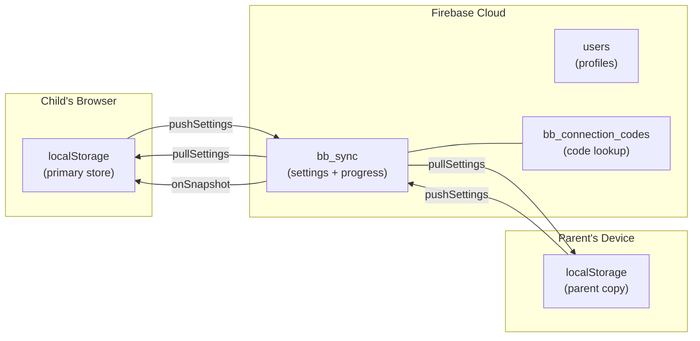
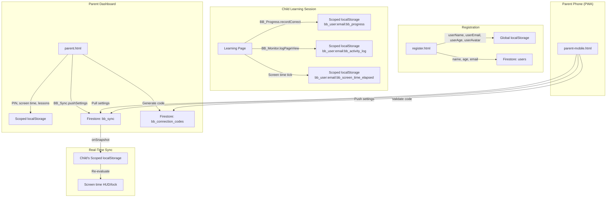

# BrainBerry — Database Schema

> Data schema reference for Firebase Firestore collections and localStorage keys.

---

## Table of Contents

- [Architecture Overview](#architecture-overview)
- [Firestore Collections](#firestore-collections)
  - [users](#users-collection)
  - [bb_sync](#bb_sync-collection)
  - [bb_connection_codes](#bb_connection_codes-collection)
- [localStorage Schema](#localstorage-schema)
  - [Namespace Pattern](#namespace-pattern)
  - [Identity Keys (Global)](#identity-keys-global)
  - [User-Scoped Keys (Namespaced)](#user-scoped-keys-namespaced)
- [Data Flow Diagram](#data-flow-diagram)
- [Data Lifecycle](#data-lifecycle)

---

## Architecture Overview

BrainBerry uses a **local-first** data architecture:

| Layer | Technology | Role |
|-------|-----------|------|
| **Primary store** | `localStorage` | All reads/writes happen locally first |
| **Cloud sync** | Firebase Firestore | Synchronises settings between devices |
| **Authentication** | Firebase Auth | Manages user identity |



---

## Firestore Collections

### `users` Collection

Stores user profile data created during registration or profile edits.

**Document ID:** User's email address (e.g. `alice@example.com`)

| Field | Type | Required | Description |
|-------|------|----------|-------------|
| `name` | `string` | Yes | User's display name |
| `email` | `string` | Yes | User's email address |
| `age` | `string` | Yes | User's age |

**Example document:**

```json
{
  "name": "Alice",
  "email": "alice@example.com",
  "age": "7"
}
```

**Written by:**
- `register.html` — on successful registration
- `assets/js/profile-panel.js` — on profile save (via `tryFirestoreSync()`)

**Write mode:** `setDoc` with `{ merge: true }` — fields are upserted, not overwritten.

---

### `bb_sync` Collection

Stores all parent-controlled settings and child progress data. This is the primary sync collection used by `BB_Sync` to push/pull data between devices.

**Document ID:** Sanitised email address (email with `.`, `#`, `$`, `[`, `]`, `/` replaced by `_`)

**Sanitisation example:**
```
alice@example.com → alice@example_com
```

| Field | Type | Required | Description |
|-------|------|----------|-------------|
| `bb_parent_pin` | `string` | No | 4-digit parent PIN |
| `bb_assigned_lessons` | `string` | No | JSON-serialised array of assigned/locked lesson IDs |
| `bb_screen_time_limit` | `string` | No | Screen time limit in seconds (as string) |
| `bb_screen_time_elapsed` | `string` | No | Elapsed screen time in seconds (as string) |
| `bb_progress` | `string` | No | JSON-serialised progress object `{ correct, wrong, lessonsCompleted }` |
| `bb_connection_code` | `string` | No | 6-digit connection code |
| `bb_todos` | `string` | No | JSON-serialised array of to-do items |
| `_email` | `string` | Yes | Raw (unsanitised) email address |
| `_updatedAt` | `string` | Yes | ISO 8601 timestamp of last update |

**Example document:**

```json
{
  "bb_parent_pin": "1234",
  "bb_assigned_lessons": "[\"phonics\",\"animals\"]",
  "bb_screen_time_limit": "1800",
  "bb_screen_time_elapsed": "450",
  "bb_progress": "{\"correct\":42,\"wrong\":8,\"lessonsCompleted\":5}",
  "bb_connection_code": "482917",
  "bb_todos": "[{\"text\":\"Practice phonics\",\"done\":false}]",
  "_email": "alice@example.com",
  "_updatedAt": "2026-06-11T12:00:00.000Z"
}
```

**Written by:**
- `BB_Sync.pushSettings()` — pushes all synced keys to this document
- `BB_Sync.syncConnectionCode()` — writes the connection code field
- Parent dashboard (`parent.html`, `parent-mobile.html`) — after saving settings

**Read by:**
- `BB_Sync.pullSettings()` — reads and writes synced keys to localStorage
- `BB_Sync.startRealtimeSync()` — listens for live changes via `onSnapshot`

**Write mode:** `setDoc` with `{ merge: true }`

> [!NOTE]
> All values in this collection are stored as **strings** because they are direct copies of localStorage values (which are always strings). JSON objects like `bb_progress` and `bb_assigned_lessons` are stored as serialised JSON strings.

---

### `bb_connection_codes` Collection

A lookup collection for validating connection codes. Each document maps a code to the email that generated it.

**Document ID:** The 6-digit connection code string (e.g. `"482917"`)

| Field | Type | Required | Description |
|-------|------|----------|-------------|
| `email` | `string` | Yes | Email of the user who generated the code |
| `createdAt` | `string` | Yes | ISO 8601 timestamp of when the code was created |

**Example document:**

```json
{
  "email": "alice@example.com",
  "createdAt": "2026-06-11T12:00:00.000Z"
}
```

**Written by:**
- `BB_Sync.syncConnectionCode(code)` — step 3 of the sync process

**Read by:**
- `BB_Sync.validateConnectionCode(code, callback)` — looks up the code to find the linked email

---

## localStorage Schema

### Namespace Pattern

BrainBerry uses two categories of localStorage keys:

1. **Global (identity) keys** — Not namespaced; shared across all users on the device
2. **User-scoped keys** — Namespaced with the pattern `bb_user:<email>:<key>`

The `BB_UserData` module handles all user-scoped reads/writes automatically.

### Identity Keys (Global)

These keys store the currently logged-in user's identity and are **not** namespaced.

| Key | Type | Description | Set By |
|-----|------|-------------|--------|
| `userName` | `string` | Display name | Registration, profile edit |
| `userEmail` | `string` | Email address | Login, registration |
| `userAge` | `string` | User's age | Registration, profile edit |
| `userAvatar` | `string` | Avatar image URL/path | Registration |
| `userAvatarKey` | `string` | Avatar selection key | Registration |
| `bb_active_user` | `string` | Canonical active user email | Login flow |
| `brainberry_current_user` | `string` | Current user email (legacy) | Login flow |
| `brainberry_users` | `string` | JSON object mapping emails to user records | Login flow |

**Cleared on sign-out:** `userName`, `userAge`, `userEmail`, `userAvatar`, `userAvatarKey`, `brainberry_current_user`

### User-Scoped Keys (Namespaced)

These keys are stored under the pattern `bb_user:<email>:<key>` and are managed via `BB_UserData`.

| Logical Key | Full Key Pattern | Type | Description | Set By |
|------------|------------------|------|-------------|--------|
| `bb_parent_pin` | `bb_user:<email>:bb_parent_pin` | `string` | 4-digit parent dashboard PIN | Parent dashboard |
| `bb_assigned_lessons` | `bb_user:<email>:bb_assigned_lessons` | `string` (JSON) | Array of assigned/locked lesson identifiers | Parent dashboard |
| `bb_screen_time_limit` | `bb_user:<email>:bb_screen_time_limit` | `string` (number) | Daily screen time limit in seconds; `"0"` = no limit | Parent dashboard |
| `bb_screen_time_elapsed` | `bb_user:<email>:bb_screen_time_elapsed` | `string` (number) | Total elapsed screen time in seconds | `assets/js/parental-control.js` (auto-incremented every second) |
| `bb_progress` | `bb_user:<email>:bb_progress` | `string` (JSON) | `{ correct, wrong, lessonsCompleted }` | `BB_Progress` API |
| `bb_connection_code` | `bb_user:<email>:bb_connection_code` | `string` | 6-digit code linking parent ↔ child devices | Parent dashboard, `BB_Sync` |
| `bb_todos` | `bb_user:<email>:bb_todos` | `string` (JSON) | Array of to-do items assigned by parent | Parent dashboard |
| `bb_activity_log` | `bb_user:<email>:bb_activity_log` | `string` (JSON) | Array of activity events (max 500 entries) | `BB_Monitor` |
| `bb_usage_stats` | `bb_user:<email>:bb_usage_stats` | `string` (JSON) | Aggregated usage statistics object | `BB_Monitor` |
| `bb_subscription` | `bb_user:<email>:bb_subscription` | `string` | Subscription plan: `"free"`, `"monthly"`, or `"yearly"` | `BB_Subscription` |

### JSON Field Schemas

#### `bb_progress`

```json
{
  "correct": 42,
  "wrong": 8,
  "lessonsCompleted": 5
}
```

| Field | Type | Default | Description |
|-------|------|---------|-------------|
| `correct` | `number` | `0` | Total correct answers |
| `wrong` | `number` | `0` | Total wrong answers |
| `lessonsCompleted` | `number` | `0` | Total lessons completed |

#### `bb_usage_stats`

```json
{
  "totalPageViews": 42,
  "totalLessonsStarted": 15,
  "totalLessonsCompleted": 12,
  "totalSessionSeconds": 3600,
  "averageScore": 78,
  "scores": [85, 70, 90],
  "firstSeen": "2026-06-01T10:00:00.000Z",
  "lastSeen": "2026-06-11T12:00:00.000Z"
}
```

| Field | Type | Default | Description |
|-------|------|---------|-------------|
| `totalPageViews` | `number` | `0` | Cumulative page view count |
| `totalLessonsStarted` | `number` | `0` | Lessons opened |
| `totalLessonsCompleted` | `number` | `0` | Lessons finished |
| `totalSessionSeconds` | `number` | `0` | Total time spent across all sessions |
| `averageScore` | `number` | `0` | Rolling average of last 50 scores |
| `scores` | `number[]` | `[]` | Last 50 lesson scores (0–100) |
| `firstSeen` | `string` | ISO date | First time the user was seen |
| `lastSeen` | `string` | ISO date | Last activity timestamp |

#### `bb_activity_log` Entry Types

| Type | Fields | Description |
|------|--------|-------------|
| `page_view` | `page`, `timestamp` | A page was viewed |
| `lesson_start` | `lesson`, `timestamp` | A lesson was started |
| `lesson_complete` | `lesson`, `score` (optional), `timestamp` | A lesson was completed |
| `session_end` | `duration`, `timestamp` | Browser tab was closed (duration in seconds) |
| `custom` | `event`, `metadata` (optional), `timestamp` | Custom event |

---

## Data Flow Diagram



---

## Data Lifecycle

### New User (First Login)

When a brand-new user logs in for the first time:

| Condition | Default |
|-----------|---------|
| Parent PIN | Not set (parent must configure) |
| Assigned lessons | None (all lessons are unlocked) |
| Screen time limit | `0` (no limit) |
| Screen time elapsed | `0` |
| Progress | `{ correct: 0, wrong: 0, lessonsCompleted: 0 }` |
| Subscription | `"free"` |

The `BB_UserData.isNewUser()` method returns `true` when both `bb_parent_pin` and `bb_assigned_lessons` are `null` for the current user.

### Sign Out

On sign out, only global identity keys are removed:
- `userName`, `userAge`, `userEmail`, `userAvatar`, `userAvatarKey`, `brainberry_current_user`

User-scoped data under `bb_user:<email>:*` is **preserved** in localStorage. When the same user logs back in, their settings, progress, and parental controls are immediately available.

### Data Retention

| Store | Retention |
|-------|-----------|
| localStorage | Persistent until browser data is cleared |
| Firestore `users` | Persistent (no TTL) |
| Firestore `bb_sync` | Persistent (no TTL) |
| Firestore `bb_connection_codes` | Persistent (no TTL) |
| Activity log | Rolling window of 500 entries (oldest trimmed) |
| Score history | Rolling window of 50 scores (oldest trimmed) |
