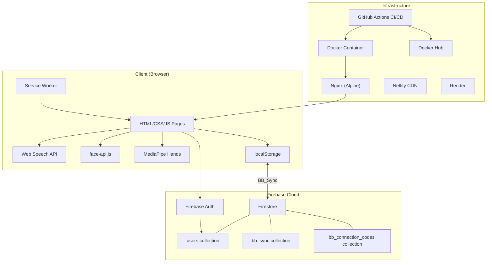
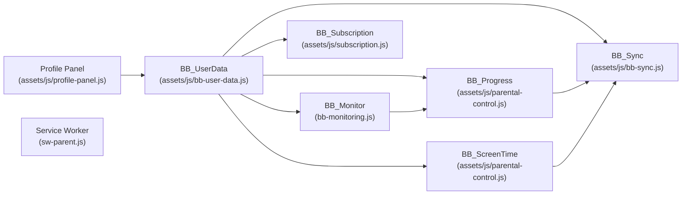
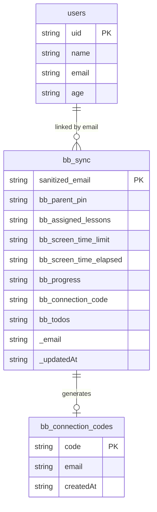
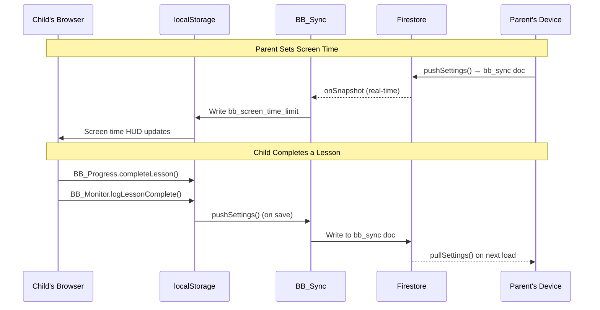
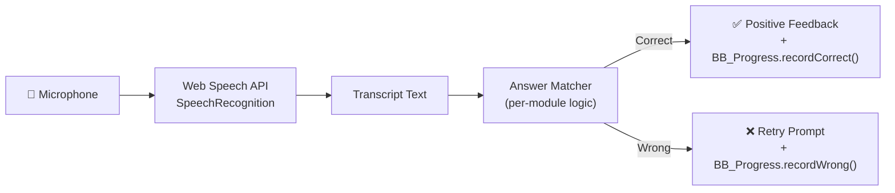
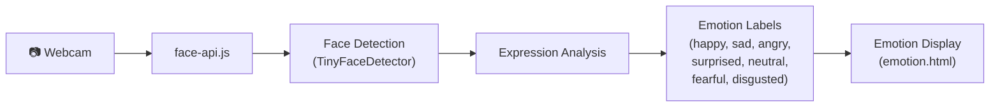
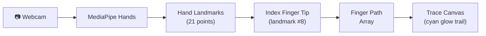
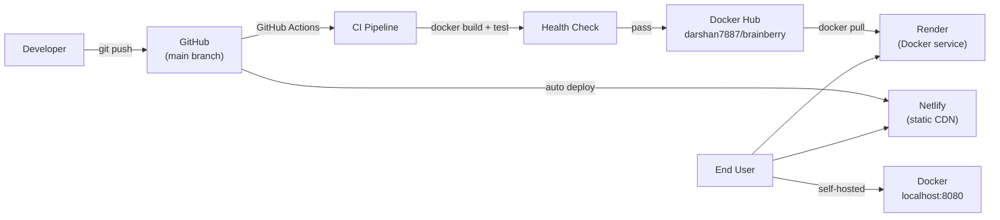

# BrainBerry — System Architecture

> Technical architecture of the BrainBerry voice-driven learning platform.

---

## High-Level Architecture



---

## Client-Side Architecture

BrainBerry is a **static web application** with no build step, no bundler, and no framework. Every page is a self-contained HTML file that loads its own CSS (inline or via `<link>`) and JavaScript (inline or via `<script>`).

### File Organisation

```
endevx/
├── index.html              # Login / landing page
├── register.html           # Multi-step registration
├── front.html              # Home dashboard (post-login)
├── Less.html               # Lessons hub
├── story.html              # Stories hub
├── chal.html               # Games hub
├── challen.html            # Challenges hub
├── parent.html             # Parent dashboard (desktop)
├── parent-app.html         # Parent PWA (desktop)
├── parent-mobile.html      # Parent PWA (mobile)
├── parent-download.html    # Parent app download page
│
├── assets/js/bb-user-data.js         # Per-user localStorage namespace utility
├── assets/js/parental-control.js     # Screen time + progress tracker
├── assets/js/profile-panel.js        # Slide-in profile sidebar with Firestore sync
├── assets/js/subscription.js         # Premium subscription gating (demo mode)
├── sw-parent.js            # Service worker for parent PWA
│
├── src/
│   └── js/
│       ├── assets/js/bb-sync.js      # Firebase Firestore real-time sync
│       └── bb-monitoring.js# Activity tracking and usage stats
│
├── config/
│   └── nginx.conf          # Nginx server configuration
│
├── assets/models/                 # ML model weight files (face-api.js)
├── assets/audio/                  # Audio assets (letter sounds, etc.)
│
├── Dockerfile              # Production Docker image (nginx:alpine)
├── docker-compose.yml      # Docker Compose for local run
├── package.json            # npm scripts (serve, docker)
├── netlify.toml            # Netlify deployment config
├── render.yaml             # Render deployment blueprint
└── .github/workflows/
    └── deploy.yml          # CI/CD pipeline
```

### Script Loading Order

Every learning page loads the core scripts in this order:

```
1. assets/js/bb-user-data.js          → Establishes per-user namespace
2. assets/js/parental-control.js      → Screen time tracking + BB_Progress API
3. assets/js/profile-panel.js         → Profile sidebar + Firestore user sync
4. assets/js/subscription.js          → Feature gating (on challenge/game pages)
5. assets/js/bb-monitoring.js  → Activity logging (auto page-view on load)
6. assets/js/bb-sync.js        → Real-time Firestore sync (dynamically loaded)
```

> [!IMPORTANT]
> `assets/js/bb-user-data.js` **must** be loaded before all other BrainBerry scripts. It establishes the `BB_UserData` namespace that all other modules depend on.

---

## Module Dependency Graph



---

## Firebase Integration

### Firebase Configuration

BrainBerry uses a single Firebase project:

| Parameter | Value |
|-----------|-------|
| **Project ID** | `brainberry-96454` |
| **Auth Domain** | `brainberry-96454.firebaseapp.com` |
| **Firebase SDK Version** | `11.0.2` (BB_Sync), `9.22.2` (profile-panel fallback) |

### Authentication Providers

Firebase Auth is configured with four sign-in methods:

| Provider | Method |
|----------|--------|
| **Email/Password** | Native Firebase Auth |
| **Google** | OAuth 2.0 popup |
| **Facebook** | OAuth 2.0 popup |
| **Twitter** | OAuth 2.0 popup |

### Firestore Collections



---

## Data Flow Architecture

### Local-First with Cloud Sync

BrainBerry uses a **local-first** architecture where localStorage is the primary data store and Firestore is the sync layer.



### localStorage Namespace Pattern

All user-scoped data follows the pattern:

```
bb_user:<email>:<key>
```

For example:
```
bb_user:alice@example.com:bb_parent_pin
bb_user:alice@example.com:bb_screen_time_limit
bb_user:alice@example.com:bb_progress
```

This ensures multiple child accounts on the same device each maintain their own isolated settings and progress data.

---

## Voice Recognition Pipeline



**Key details:**
- Uses `webkitSpeechRecognition` (Chrome) or `SpeechRecognition` (standard)
- Language is set per-module (`en-US` for English, `hi-IN` for Hindi)
- Continuous recognition mode is disabled to capture single utterances
- HTTPS is required for microphone access in production

---

## ML Pipeline — Emotion Detection



**Model files** are stored in the repository root and the `assets/models/` directory:
- `age_gender_model-shard1`
- `age_gender_model-weights_manifest.json`
- `mtcnn_model-shard1`
- `mtcnn_model-weights_manifest.json`
- Additional TinyFaceDetector and expression models in `assets/models/`

The main emotion detection UI is in `emotion.html`, which loads `face-api.js` (860 KB) and runs inference directly in the browser.

---

## ML Pipeline — Air Writing



**Implementation:** `assets/js/airwriting-opencv.js`
- Uses `@mediapipe/hands` from CDN
- Tracks the index finger tip (landmark 8) across frames
- Renders a glowing cyan trail on a 400×300 canvas
- Camera feed is mirrored on a separate canvas for visual feedback

---

## PWA Architecture (Parent App)

The parent mobile app (`parent-mobile.html`) is a Progressive Web App with:

### Web App Manifest (`manifest-parent.json`)

| Property | Value |
|----------|-------|
| `name` | BrainBerry Parent |
| `short_name` | BB Parent |
| `display` | standalone |
| `orientation` | portrait-primary |
| `theme_color` | #8b5cf6 |
| `background_color` | #0a021e |
| `start_url` | ./parent-mobile.html |

### Service Worker (`sw-parent.js`)

| Strategy | Scope |
|----------|-------|
| **Pre-cache** | `parent-mobile.html`, `manifest-parent.json`, `icon-192.png`, `icon-512.png` |
| **Cache-first** | Google Fonts, Firebase SDK CDN files |
| **Stale-while-revalidate** | All same-origin local files |
| **Network-only** | Firebase Auth API calls (`identitytoolkit`, `securetoken`, `firestore`) |

Cache name: `bb-parent-v1`

---

## Deployment Architecture



### Container Architecture

```
┌──────────────────────────────┐
│  Docker Container            │
│  ┌────────────────────────┐  │
│  │  nginx:alpine          │  │
│  │  Port 80               │  │
│  │  ┌──────────────────┐  │  │
│  │  │ /usr/share/nginx/ │  │  │
│  │  │ html/             │  │  │
│  │  │  ├── index.html   │  │  │
│  │  │  ├── front.html   │  │  │
│  │  │  ├── *.html       │  │  │
│  │  │  ├── *.js         │  │  │
│  │  │  ├── *.css        │  │  │
│  │  │  ├── *.mp4        │  │  │
│  │  │  └── assets/models/      │  │  │
│  │  └──────────────────┘  │  │
│  └────────────────────────┘  │
│  Exposed: Port 80            │
│  Healthcheck: wget localhost │
└──────────────────────────────┘
```

### Nginx Configuration Highlights

| Feature | Configuration |
|---------|---------------|
| **Compression** | gzip level 6 for text, CSS, JS, JSON, SVG |
| **Media caching** | 30-day cache for mp4, png, jpg, mp3, fonts |
| **JS/CSS caching** | 7-day cache |
| **ML models** | 30-day cache + CORS headers (`Access-Control-Allow-Origin: *`) |
| **Security** | `X-Frame-Options: SAMEORIGIN`, `X-Content-Type-Options: nosniff`, `X-XSS-Protection` |
| **MIME types** | Custom block covering ML model shard files (`application/octet-stream`) |
| **Fallback** | `try_files $uri $uri/ /index.html` |
| **Hidden files** | Denied (`location ~ /\.`) |
